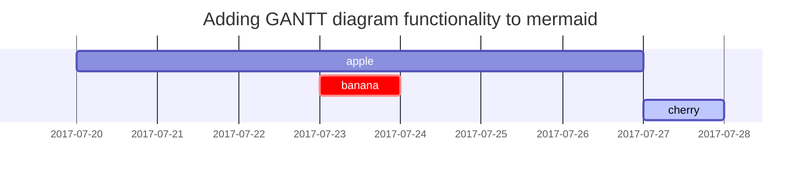

这篇文章是为了展示在[**Chirpy**](https://github.com/cotes2020/jekyll-theme-chirpy/fork)上渲染Markdown语法，您也可以将其作为写作示例。现在，让我们开始看一下文本和排版。

## 标题

<h1 class="mt-5">H1 - 标题</h1>

<h2 data-toc-skip>H2 - 标题</h2>

<h3 data-toc-skip>H3 - 标题</h3>

<h4>H4 - 标题</h4>

## 段落

Quisque egestas convallis ipsum, ut sollicitudin risus tincidunt a. Maecenas interdum malesuada egestas. Duis consectetur porta risus, sit amet vulputate urna facilisis ac. Phasellus semper dui non purus ultrices sodales. Aliquam ante lorem, ornare a feugiat ac, finibus nec mauris. Vivamus ut tristique nisi. Sed vel leo vulputate, efficitur risus non, posuere mi. Nullam tincidunt bibendum rutrum. Proin commodo ornare sapien. Vivamus interdum diam sed sapien blandit, sit amet aliquam risus mattis. Nullam arcu turpis, mollis quis laoreet at, placerat id nibh. Suspendisse venenatis eros eros.

## 列表

### 有序列表

1. Firstly
2. Secondly
3. Thirdly

### 无序列表

- Chapter
  + Section
    * Paragraph

### 待办事项列表

- [ ] Job
  + [x] Step 1
  + [x] Step 2
  + [ ] Step 3


### 描述性列表

Sun
: the star around which the earth orbits

Moon
: the natural satellite of the earth, visible by reflected light from the sun

## 引用块

> 这一行展示了 _block quote_.

## 提示
> 一个展示 `tip` 类型提示的例子。
{: .prompt-tip }

> 一个展示 `info` 类型提示的例子。
{: .prompt-info }

> 一个展示 `warning` 类型提示的例子。
{: .prompt-warning }

> 一个展示 `danger` 类型提示的例子。
{: .prompt-danger }

## 表格

| Company                      | Contact          | Country |
|:-----------------------------|:-----------------|--------:|
| Alfreds Futterkiste          | Maria Anders     | Germany |
| Island Trading               | Helen Bennett    | UK      |
| Magazzini Alimentari Riuniti | Giovanni Rovelli | Italy   |

## 链接

<http://127.0.0.1:4000>

## 脚注

点击链接将跳转至脚注[^footnote]，这是另一个脚注[^fn-nth-2]。

## 内联代码

这是一个内联代码的示例：`Inline Code`。

## 文件路径
这是文件路径 `/path/to/the/file.extend`{: .filepath}。

## 代码块

### 通用代码块

```
这是一个普通的代码块，没有语法高亮和行号。
```

### 特定语言

```bash
if [ $? -ne 0 ]; then
  echo "The command was not successful.";
  #do the needful / exit
fi;
```

### 特定文件名

```sass
@import
  "colors/light-typography",
  "colors/dark-typography";
```
{: file='_sass/jekyll-theme-chirpy.scss'}

## 数学公式

使用 [**MathJax**](https://www.mathjax.org/) 渲染的数学公式：
$$ \sum_{n=1}^\infty 1/n^2 = \frac{\pi^2}{6} $$

当 $a \ne 0$时, $ax^2 + bx + c = 0$有两个解，它们分别是：

$$ x = {-b \pm \sqrt{b^2-4ac} \over 2a} $$

## Mermaid SVG



## 图片

### 默认 (带标题)

{: width="972" height="589" }
_Full screen width and center alignment_

### 左对齐

{: width="972" height="589" .w-75 .normal}

### 左浮动

{: width="972" height="589" .w-50 .left}
Praesent maximus aliquam sapien. Sed vel neque in dolor pulvinar auctor. Maecenas pharetra, sem sit amet interdum posuere, tellus lacus eleifend magna, ac lobortis felis ipsum id sapien. Proin ornare rutrum metus, ac convallis diam volutpat sit amet. Phasellus volutpat, elit sit amet tincidunt mollis, felis mi scelerisque mauris, ut facilisis leo magna accumsan sapien. In rutrum vehicula nisl eget tempor. Nullam maximus ullamcorper libero non maximus. Integer ultricies velit id convallis varius. Praesent eu nisl eu urna finibus ultrices id nec ex. Mauris ac mattis quam. Fusce aliquam est nec sapien bibendum, vitae malesuada ligula condimentum.

### 右浮动

{: width="972" height="589" .w-50 .right}
Praesent maximus aliquam sapien. Sed vel neque in dolor pulvinar auctor. Maecenas pharetra, sem sit amet interdum posuere, tellus lacus eleifend magna, ac lobortis felis ipsum id sapien. Proin ornare rutrum metus, ac convallis diam volutpat sit amet. Phasellus volutpat, elit sit amet tincidunt mollis, felis mi scelerisque mauris, ut facilisis leo magna accumsan sapien. In rutrum vehicula nisl eget tempor. Nullam maximus ullamcorper libero non maximus. Integer ultricies velit id convallis varius. Praesent eu nisl eu urna finibus ultrices id nec ex. Mauris ac mattis quam. Fusce aliquam est nec sapien bibendum, vitae malesuada ligula condimentum.

### 深色/浅色模式 & 阴影效果

下面的图片根据主题偏好切换到深色/浅色模式，注意它具有阴影效果。

{: .light .w-75 .shadow .rounded-10 w='1212' h='668' }
{: .dark .w-75 .shadow .rounded-10 w='1212' h='668' }

## 视频



## 反向脚注

[^footnote]: The footnote source
[^fn-nth-2]: The 2nd footnote source